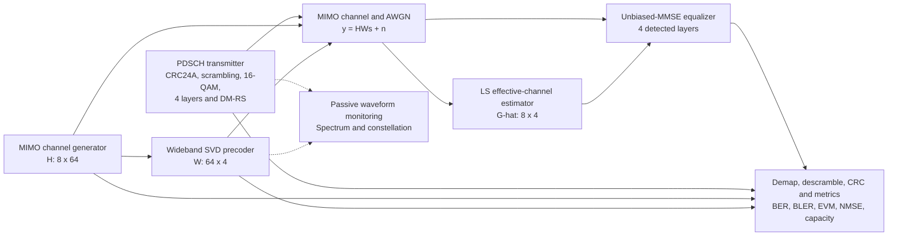

# 5G NR Massive MIMO Simulink Testbench

**PDSCH-oriented 64x8 Massive MIMO-OFDM system modeling, instrumentation, and MATLAB-reference validation**

**Author:** Md Moklesur Rahman  
**Implementation:** MATLAB and Simulink  
**Primary model:** `Matlab_File/NR_PDSCH_LinkLevel_Sim.slx`  
**Status:** Executed 7-point massive-profile sweep; all stored comparison points pass

---

## Overview

This project presents a Simulink testbench for a PDSCH-oriented 5G NR Massive MIMO-OFDM physical-layer link. The active massive profile uses **64 transmit antennas, 8 receive antennas, 4 spatial layers, wideband SVD eigenbeamforming, DM-RS-based least-squares effective-channel estimation, and unbiased-MMSE equalization**.

The testbench advances **one complete Monte Carlo frame per fixed simulation step**. Simulink provides the system-level execution, scheduling, signal routing, displays, workspace logging, and RF instrumentation. The numerical algorithms are called through thin `sl_*.m` wrappers, which reuse the verified MATLAB functions rather than maintaining a second, divergent implementation.

> This is a PDSCH-oriented link-level engineering model. It is not a complete gNB/UE protocol stack and does not model MAC scheduling, HARQ timing, RF hardware impairments, or multi-user operation.

## Project Highlights

- 64x8 single-user Massive MIMO with four spatial layers
- 144 active subcarriers on a 256-point FFT
- 14 OFDM symbols per 0.5 ms slot at 30 kHz subcarrier spacing
- CRC24A-protected uncoded transport block
- NR Gold-sequence scrambling and deterministic QPSK DM-RS
- Wideband SVD/eigenbeamforming precoder
- Flat Rayleigh MIMO channel and calibrated complex AWGN
- DM-RS-based LS estimation of the effective channel
- ZF or unbiased-MMSE equalization
- BER, BLER, EVM, NMSE, and capacity outputs
- Verification gates before the first simulated frame
- Automated SNR sweep and MATLAB-reference comparison
- Passive CP-OFDM spectrum, PAPR, and constellation monitoring
- Self-identifying CSV output with antenna and layer dimensions

## System Architecture



A full Simulink model image is available in [`Figures/simulink_model_64x8.png`](Figures/simulink_model_64x8.png).

## Massive-Profile Configuration

| Parameter | Executed value |
|---|---:|
| Transmit antennas | 64 |
| Receive antennas | 8 |
| Spatial layers | 4 |
| Modulation | 16-QAM |
| FFT size | 256 |
| Active subcarriers | 144 (12 RB reduced grid) |
| OFDM symbols | 14 |
| Subcarrier spacing | 30 kHz |
| Slot duration | 0.5 ms |
| DM-RS symbols | 4 and 11 |
| DM-RS comb spacing | 4 |
| Precoder | Wideband SVD eigenbeamforming |
| Channel | Flat Rayleigh, one realization per frame |
| Equalizer | Unbiased MMSE |
| SNR grid | -10:5:20 dB |
| Frames per point | 60 |
| Payload bits per frame | 27,624 |
| Random seed | 7 |

### Principal Matrix Dimensions

| Quantity | Dimension |
|---|---:|
| Physical channel `H[k]` | 8 x 64 |
| Precoder `W` | 64 x 4 |
| Effective channel `G[k] = H[k]W` | 8 x 4 |
| Layer vector `s[k]` | 4 x 1 |
| Transmit vector `x[k]` | 64 x 1 |
| Receive vector `y[k]` | 8 x 1 |

## Simulink Block-to-Code Traceability

| Simulink block | Wrapper | Core MATLAB implementation |
|---|---|---|
| PDSCH Transmitter | `sl_transmitter.m` | `build_frame.m`, CRC, scrambling, QAM and DM-RS functions |
| MIMO Channel Generator | `sl_channel.m` | `generate_channel.m` |
| Wideband SVD Precoder | `sl_precoder.m` | `compute_precoder.m` |
| MIMO Channel + AWGN | `sl_apply_channel.m` | `apply_mimo_channel.m` |
| LS Channel Estimator | `sl_estimator.m` | `estimate_effective_channel_ls.m` |
| ZF-MMSE Equalizer | `sl_equalizer.m` | `equalize_mimo.m` |
| Demap Descramble CRC Metrics | `sl_metrics.m` | `compute_frame_metrics.m` |
| OFDM Waveform | `sl_waveform.m` | `ofdm_modulate.m` |

The MATLAB Function blocks declare fixed output dimensions when the model is built. Therefore, changes to antenna counts, layer count, FFT size, active subcarriers, modulation order, or DM-RS allocation require the model to be rebuilt.

## Verification Gates

The model initialization callback executes `run_verification_gates.m` before the first frame. A failed assertion stops the simulation.

1. **Constellation-power gate:** verifies unit average power for QPSK, 16-QAM, 64-QAM and 256-QAM.
2. **Noiseless modulation round trip:** verifies bit-exact mapping and hard demapping.
3. **OFDM round trip:** verifies CP-OFDM modulation/demodulation at machine-precision reconstruction error.
4. **CRC24A gate:** accepts an intact block and rejects a deliberately corrupted block.

## MATLAB-Simulink Validation

The massive-profile sweep compares Simulink aggregates with `matlab_results_massive.csv` using:

| Metric | Acceptance tolerance |
|---|---:|
| BER | 0.3 decades |
| BLER | 0.25 absolute |
| EVM | 10% relative |
| NMSE | 0.15 decades |
| Capacity | 2% relative |

### Stored Massive Sweep

| SNR (dB) | BER | BLER | EVM (%) | NMSE | Capacity (bit/s/Hz) | Verdict |
|---:|---:|---:|---:|---:|---:|:---:|
| -10 | 3.373e-01 | 1.00 | 84.59 | 1.390e+00 | 6.46 | PASS |
| -5 | 1.937e-01 | 1.00 | 55.26 | 4.395e-01 | 11.64 | PASS |
| 0 | 7.345e-02 | 1.00 | 33.30 | 1.390e-01 | 17.72 | PASS |
| 5 | 8.748e-03 | 1.00 | 19.26 | 4.395e-02 | 24.18 | PASS |
| 10 | 9.352e-05 | 0.85 | 10.93 | 1.390e-02 | 30.76 | PASS |
| 15 | 0.000e+00 | 0.00 | 6.17 | 4.395e-03 | 37.39 | PASS |
| 20 | 0.000e+00 | 0.00 | 3.47 | 1.390e-03 | 44.02 | PASS |

All **7 of 7 SNR points pass**. The largest stored deviations are approximately:

- BER: **0.063 decades**
- BLER: **0.000 absolute**
- EVM: **0.63% relative**
- NMSE: **0.006 decades**
- Capacity: **0.47% relative**

The zero BER entries at 15 and 20 dB mean that no errors were observed in the finite 60-frame run; they should not be interpreted as a mathematically zero error probability.

## Quick Start

### Requirements

- MATLAB
- Simulink
- Communications Toolbox functions are not required for the core custom algorithms
- DSP System Toolbox and Communications Toolbox are useful for the live Spectrum Analyzer and Constellation Diagram blocks; toolbox-free plots remain available through `plot_rf_measurements.m`

### 1. Open the executable folder

In MATLAB, set the **Current Folder** to:

```text
01_5G_NR_Massive_MIMO_Simulink_Testbench/Matlab_File
```

### 2. Generate the MATLAB reference

```matlab
run_massive_mimo
```

This writes the reference CSV under:

```text
../04_Simulation_Results/MATLAB/csv/matlab_results_massive.csv
```

### 3. Build the 64x8 testbench

```matlab
build_massive_testbench
```

This selects the massive profile, rebuilds fixed block dimensions, and adds the RF monitoring branch.

### 4. Open and run one operating point

```matlab
open_system('NR_PDSCH_LinkLevel_Sim')
```

Set the `SNR (dB)` Constant block and press **Run**. The massive profile uses a stop time of `59`, corresponding to 60 frames indexed from 0 to 59.

### 5. Execute the complete SNR sweep

```matlab
sweep_snr_grid
```

The script checks model dimensions, runs all seven SNR points, compares every metric with the MATLAB reference, prints the deviations and verdicts, and writes:

```text
Matlab_File/simulink_results_massive.csv
```

### 6. Generate RF plots

After running the model:

```matlab
plot_rf_measurements
```

This generates:

```text
rf_psd.png
rf_papr_ccdf.png
rf_constellation.png
```

## Single-Point Execution Sequence

```matlab
set_sim_profile('massive');
build_nr_pdsch_simulink;
add_rf_measurements;
open_system('NR_PDSCH_LinkLevel_Sim');
sim('NR_PDSCH_LinkLevel_Sim');
plot_rf_measurements;
```

## Main Output Variables

| Workspace variable | Meaning |
|---|---|
| `log_bitErrors` | Frame-wise detected payload-bit errors |
| `log_nBits` | Frame-wise evaluated payload bits |
| `log_blockError` | CRC-based block-error decision |
| `log_evm` | Frame-wise RMS EVM |
| `log_nmse` | Effective-channel estimation NMSE |
| `log_capacity` | Layer-domain capacity reference |
| `log_shat` | Equalized layer symbols |
| `log_txWaveform` | Precoded CP-OFDM transmit waveform |

Use the aggregate BER:

```matlab
ber = sum(log_bitErrors) / sum(log_nBits);
```

## Repository Structure

```text
01_5G_NR_Massive_MIMO_Simulink_Testbench/
├── README.md
├── LICENSE
├── CITATION.cff
├── .gitignore
├── Matlab_File/
│   ├── NR_PDSCH_LinkLevel_Sim.slx
│   ├── config.m
│   ├── build_massive_testbench.m
│   ├── build_nr_pdsch_simulink.m
│   ├── add_rf_measurements.m
│   ├── sl_*.m
│   ├── core MATLAB functions
│   ├── sweep_snr_grid.m
│   ├── plot_rf_measurements.m
│   └── simulink_results_massive.csv
├── 04_Simulation_Results/
│   └── MATLAB/csv/
│       ├── matlab_results_massive.csv
│       └── matlab_results_massive_config.txt
├── Figures/
│   ├── simulink_model_64x8.png
│   ├── architecture_flow.png
│   ├── verification_flow.png
│   ├── matlab_simulink_ber_comparison.png
│   └── RF measurement figures
└── Report/
    ├── 5G_NR_Massive_MIMO_Simulink_Testbench_Report.docx
    └── 5G_NR_Massive_MIMO_Simulink_Testbench_Report.pdf
```

Generated folders such as `slprj/`, `codegen/`, and simulation cache files are intentionally excluded from version control.

## Modeling Notes

- The testbench is **fixed-step discrete** with a step size of one; one step represents one complete Monte Carlo frame.
- The model runs the MATLAB functions in interpreted mode through `coder.extrinsic`, so a C compiler is optional.
- The active profile is stored in `sim_profile.txt`.
- The current LS estimator performs pilot division, averaging across the two DM-RS symbols, and linear interpolation with linear extrapolation at the frequency edges.
- The total-transmit-SNR noise variance is `nLayers / 10^(SNRdB/10)`, keeping comparisons at equal total transmitted power.
- The passive monitoring branch does not feed back into BER/BLER processing.

## Limitations

- Single-cell, single-user downlink baseband model
- Flat i.i.d. Rayleigh massive-profile channel
- Ideal timing and carrier-frequency synchronization
- No spatial correlation or explicit antenna-array geometry
- Ideal transmitter channel knowledge for precoder calculation
- Uncoded CRC-protected payload in the Simulink testbench
- Hard-decision detection
- No HARQ, scheduler, mobility, phase noise, IQ imbalance, PA nonlinearity, or RF front-end model
- Simulink wrappers call MATLAB algorithms; the Simulink testbench is a third execution environment, not an independently rewritten numerical implementation

## Technical Report

The report is available in:

- [`Report/5G_NR_Massive_MIMO_Simulink_Testbench_Report.pdf`](Report/5G_NR_Massive_MIMO_Simulink_Testbench_Report.pdf)


## Citation

```bibtex
@software{rahman2026massivemimosimulink,
  author  = {Md Moklesur Rahman},
  title   = {5G NR Massive MIMO Simulink Testbench},
  year    = {2026},
  url     = {https://github.com/dipucwc}
}
```

## License

The source code is provided under the MIT License. See [`LICENSE`](LICENSE).
